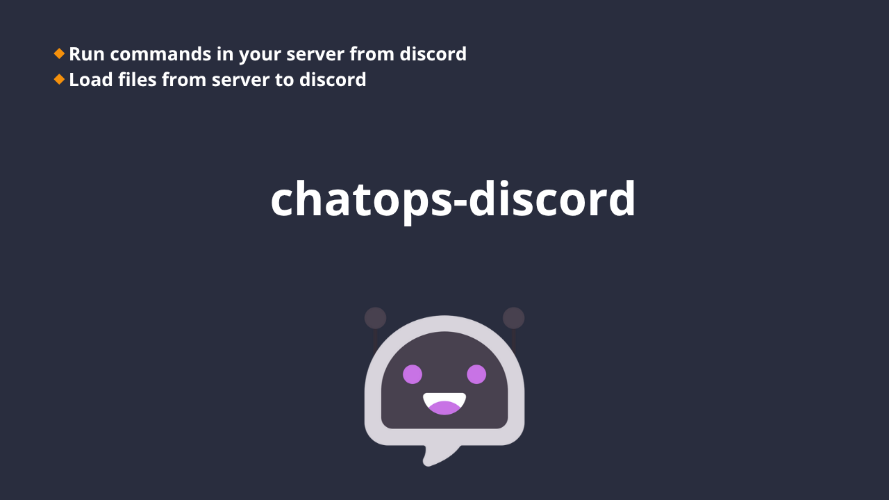

# ChatOPS Discord

Ejecuta comandos en tu servidor y visualizalos en Discord, sin necesidad de logearte por SSH ni configurar nada, solo habilita un bot desde discord y coloca el token en el codigo

## Features:

- run commands via chat
- load files from server to discord
- customs commands
